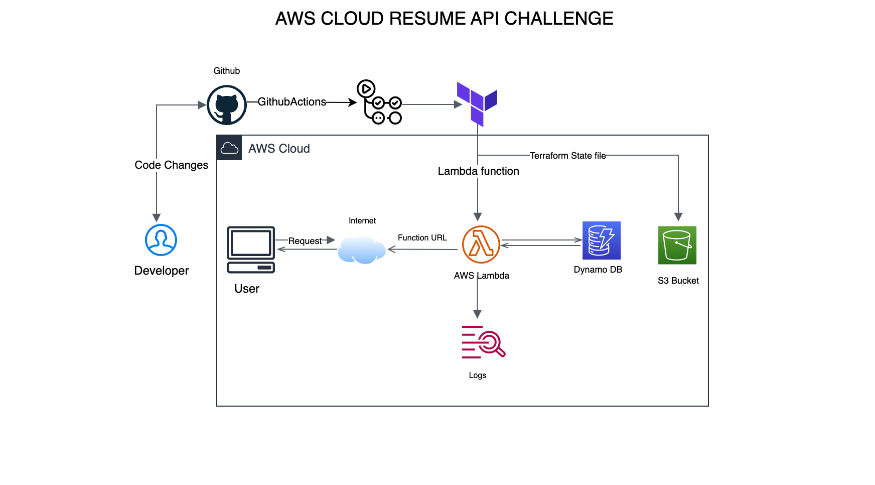

## Resume Fetcher API
This project establishes an AWS Lambda function to retrieve resume data from a DynamoDB table and makes it accessible through a Function URL. The entire setup and deployment process is automated using Terraform and GitHub Actions.

## Prerequisites
Before you start, make sure you have the following installed:

- [X] AWS CLI

- [X] Terraform

- [X] Python 3.8

- [X] Pip

- [X] An AWS account with necessary permissions

- [X] GitHub account with access to create and use GitHub Actions

## Setup Instructions

#### Create a DynamoDB table:

- Go to the AWS Console and search for DynamoDB.
- Click on Tables and create a table with a unique name related to resumes, e.g., Resume_cloud.

## Set Up Table Key:
- In the Key section, enter id (ensure consistency in the use of lowercase or uppercase).
- Do not assign any value to the item yet, as the goal is to fetch the JSON data using only the resume ID.

## Add Resume Data:
- Insert the resume data from resume.json into the table using the AWS CLI with the following command:

```
aws dynamodb put-item --table-name Resumes --item file://resume.json. --region us-east-2
```
## Replace the placeholders:
- In the command, change --table-name "Resumes" to the name of your DynamoDB table.
- Change --region "us-east-2" to the region where your table is located.

## Verify the data:
- After running the command, go back to your DynamoDB table in the AWS Console.
- Check to make sure the resume data is now in the table.

#### Install Dependencies

## Navigate to your project folder:
Open your command line interface (CLI) and go to the folder where your project is located.
## Install the required libraries:
Run this command to install all the necessary libraries listed in requirements.txt into a folder named package:

```
pip install -r requirements.txt -t package/
```


#### Package the Lambda Function
Package the lambda function

Prepare the package:

Move to the package folder:

```
cd package
```
```
zip -r ../lambda_function.zip .
```
```
cd ..
zip -g lambda_function.zip lambda_function.py
```

#### Terraform Configuration

## Configure  main.tf:
Make sure the main.tf file in your project is set up correctly as shown in your code base.

## Create an S3 Bucket for Terraform State Files:
This bucket will keep track of changes to your Terraform state file.

## Using the AWS Console:
- Go to the AWS Console and search for S3.
- Click on Create Bucket and give your bucket a unique name.
- While creating the bucket, make sure to enable Bucket Versioning.
- Click Create to finish.

## Using the AWS CLI :

`aws s3api create-bucket --bucket your-bucket-name --region your-region --version enable`


Check the AWS Console to verify that the bucket has been created.

## Configure provider.tf:
 Ensure that the provider.tf file is set up to use the S3 bucket you just created for storing your Terraform state file.

## Initialize and Apply Terraform Configuration:
 Once you've set up the bucket and configuration, run the following commands to initialize and apply your Terraform setup:

```
terraform init
```
```
terraform plan
```
```
terraform apply

```
# Note: GitHub Actions was used as my CI/CD tool.
# Deploy Using GitHub Actions
# Create a GitHub Repository:
 - Create a new repository on GitHub.
 - Push your project files to this repository.
 - Confirm that your GitHub account has permission to run GitHub Actions.
 - When you open your project repository on GitHub, you should see an Actions tab. This indicates that GitHub Actions is available for your repository.

 

- Click on it and click on setup your workflow yourself


## Open the Actions Tab:
- In your GitHub repository, go to the Actions tab. You may see a sample YAML file here.
- Delete the sample YAML file if it's not needed for your project.
- Create a new file named resume.yml (or any name that fits your project) in the .github/workflows/ directory of your project.
- You can place this file in the .github/workflows/ folder in your code base.


## Access the API:
- Once your API is deployed, you can access it using the Function URL.
- This URL will be provided after you run the terraform apply command.
- You can also find it in the AWS Console by:
- Going to Lambda.
- Clicking on Functions.
- Find your function named resume_fetcher.
- The Function URL will be displayed on the function's page.

## Testing your API using Postman:
- Open Postman.
- Create a new GET request.
```
https://{function-url}/resume/{id}

```
- Replace {function-url} with your actual Function URL and {id} with the specific resume ID you want to retrieve.
- Click Send.
- You should get a response with the resume data in JSON format and a status code of 200, indicating the API is working.


## Clean Up
To delete all the AWS resources created by this project, run:

```
terraform destroy

```
This command will remove all AWS resources associated with this project.

## Troubleshooting
If you run into any issues, check the following:

## AWS Credentials:
- Ensure that your AWS credentials are properly configured and have the necessary permissions.

## Lambda Function ZIP File:
- Verify that the lambda_function.zip file was created correctly and is referenced properly in your configuration.

## Terraform Setup:
- Make sure that Terraform is initialized and configured correctly. Run terraform init to initialize and check for any errors.